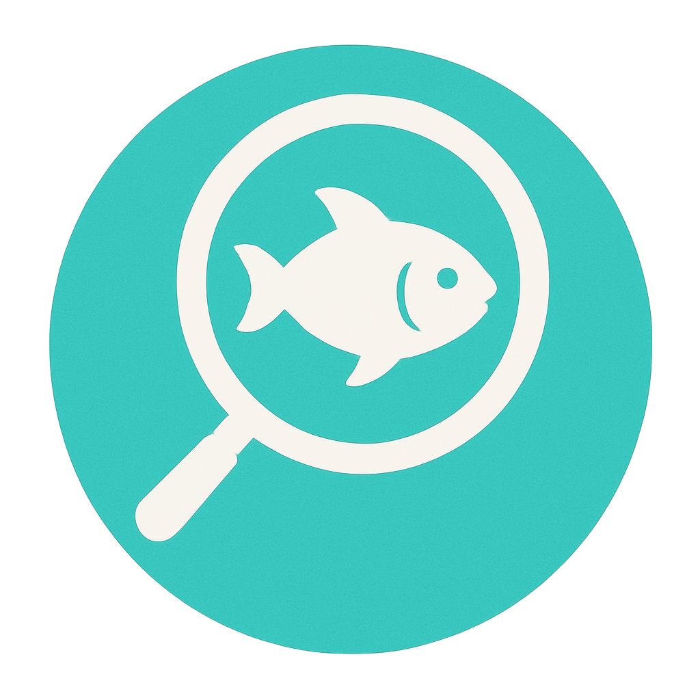
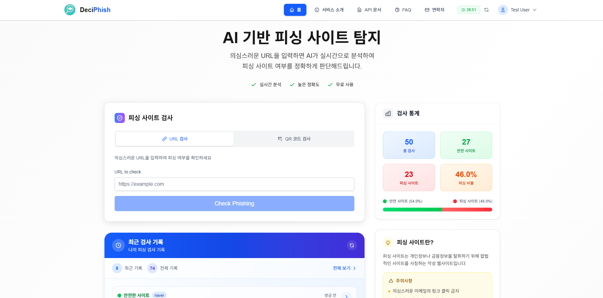
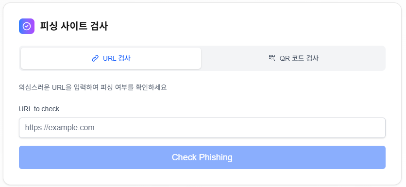
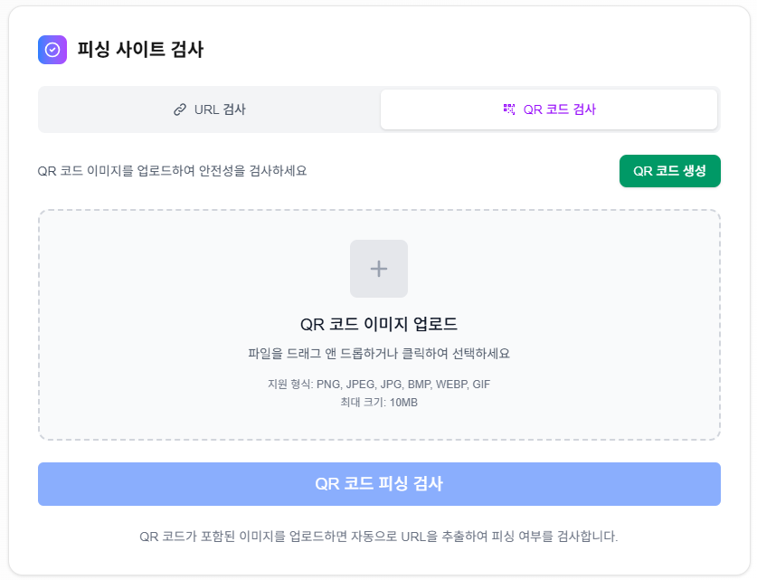
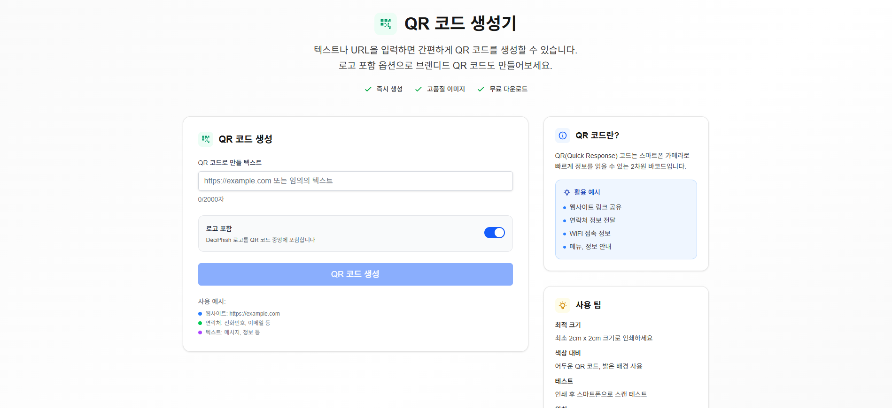
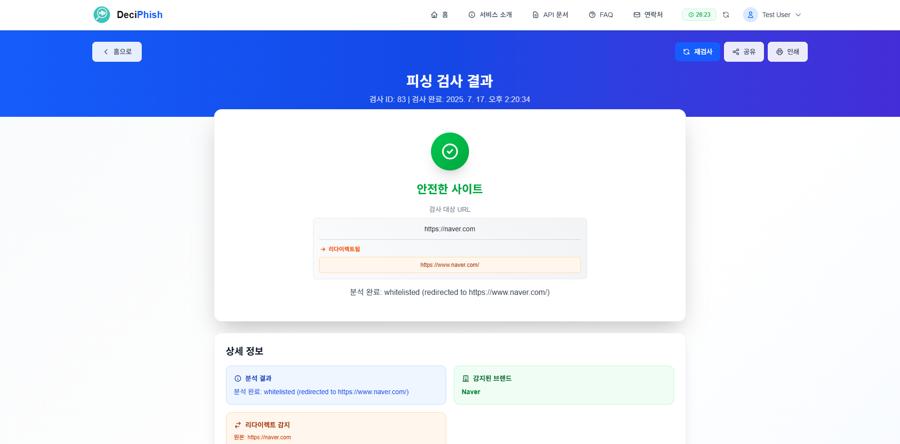
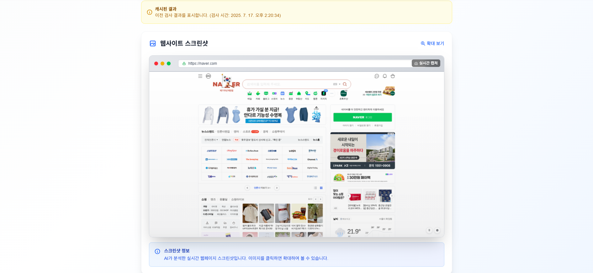
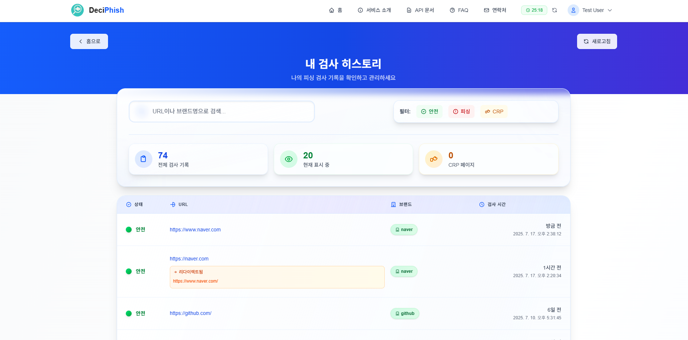
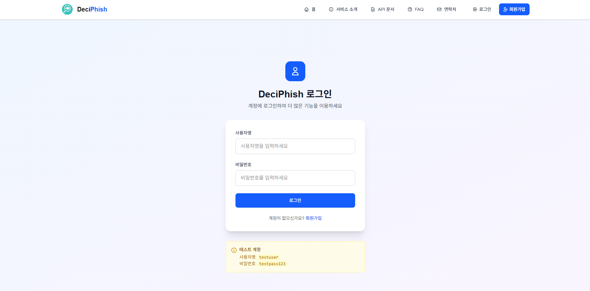

<div align="center">
  
  
  # DeciPhish
</div>

AI 기반 피싱 사이트 탐지 시스템으로, 웹 애플리케이션, API 서버, 크롬 익스텐션을 통해 다양한 환경에서 피싱 사이트를 탐지하고 차단할 수 있는 종합적인 보안 솔루션입니다.

## 프로젝트 구성

DeciPhish는 다음 3개의 주요 컴포넌트로 구성되어 있습니다:

### 1. **deciphish-web** - 웹 애플리케이션
Next.js 기반의 웹 애플리케이션으로 사용자 친화적인 인터페이스를 제공합니다.

**주요 기능:**
- AI 기반 피싱 사이트 탐지
- 실시간 URL 검사 및 QR 코드 피싱 검사
- QR 코드 생성 및 분석 도구
- 사용자 인증 및 검사 히스토리 관리
- 통계 대시보드 및 개인화된 서비스

**기술 스택:**

| 기술 영역 | 사용 기술 | 버전 |
|----------|-----------|------|
| **Frontend** | Next.js | 15 (App Router) |
| | TypeScript | 5 |
| | Tailwind CSS | 4 |
| **State Management** | React Context API | - |
| **HTTP Client** | Fetch API, Axios | - |

### 2. **deciphish-api** - 백엔드 API 서버
FastAPI 기반의 고성능 백엔드 서버로 AI 기반 피싱 탐지 엔진을 제공합니다.

**주요 기능:**
- 다중 레이어 피싱 탐지 (URL 리다이렉트 추적, 파비콘 분석, 텍스트 분석)
- CLIP 모델 기반 브랜드 로고 인식
- Gemini LLM을 활용한 페이지 콘텐츠 분석
- QR 코드 인식 및 생성 엔진
- 사용자 인증 및 히스토리 관리

**기술 스택:**

| 기술 영역 | 사용 기술 | 버전 |
|----------|-----------|------|
| **Backend Framework** | FastAPI | Latest |
| **Language** | Python | 3.8+ |
| **Database** | MySQL | 8.0+ |
| **ORM** | SQLAlchemy | Latest |
| **Authentication** | JWT | - |
| **Deployment** | Docker & Docker Compose | Latest |
| **QR Processing** | OpenCV, pyzbar, qrcode | Latest |
| **Image Processing** | Pillow | Latest |

**AI/ML 모델:**

| 모델/서비스 | 용도 | 특징 |
|------------|------|------|
| **CLIP** | 파비콘 이미지 분석 및 브랜드 인식 | OpenAI 사전훈련 모델 |
| **Gemini API** | 자연어 처리 및 텍스트 분석 | Google의 대규모 언어 모델 |
| **Custom CRP Classifier** | 피싱 패턴 분류 | XLM-RoBERTa 기반 커스텀 모델 |

### 3. **deciphish-extension** - 크롬 익스텐션
실시간 피싱 사이트 탐지 및 차단을 위한 Chrome 브라우저 익스텐션입니다.

**주요 기능:**
- 자동 실시간 피싱 탐지 및 즉시 차단
- 백그라운드 자동 검사 및 수동 검사
- 피싱 사이트 감지 시 경고 페이지 표시
- 검사 통계 및 히스토리 관리
- 클라우드 동기화 및 멀티 디바이스 지원

**기술 스택:**

| 기술 영역 | 사용 기술 | 버전 |
|----------|-----------|------|
| **Extension API** | Manifest V3 | Latest |
| **Language** | Vanilla JavaScript | ES6+ |
| **Browser APIs** | Chrome Extensions API | Latest |
| **Styling** | CSS3 | Flexbox/Grid |
| **Storage** | Chrome Storage API | - |

## 시작하기

### 사전 요구사항

- **Node.js** 18.0.0 이상
- **Python** 3.8 이상
- **MySQL** 8.0 이상
- **Docker & Docker Compose** (권장)
- **Chrome 브라우저** (익스텐션 사용 시)

### 전체 시스템 설치

> **주의**: 각 컴포넌트는 별도의 저장소로 관리됩니다. 현재 모든 저장소는 비공개(private) 상태입니다.

#### 1. 각 컴포넌트 저장소 클론
```bash
# 작업 디렉토리 생성
mkdir deciphish-platform
cd deciphish-platform

# 각 컴포넌트 저장소 클론 (현재 비공개 상태라 불가능)
git clone https://github.com/kimyt990501/deciphish-api.git
git clone https://github.com/kimyt990501/deciphish-web.git
git clone https://github.com/kimyt990501/deciphish-extension.git
```

#### 2. API 서버 실행
```bash
cd deciphish-api

# 환경 변수 설정
cp env.example .env
# .env 파일 편집하여 필요한 설정 입력

# Docker로 실행 (권장)
chmod +x docker-build.sh
./docker-build.sh dev

# 또는 로컬에서 실행
pip install -r requirements.txt
python -m uvicorn app.main:app --reload --port 8300
```

#### 3. 웹 애플리케이션 실행
```bash
cd ../deciphish-web

# 환경 변수 설정
echo "NEXT_PUBLIC_API_URL=http://localhost:8300" > .env.local

# 의존성 설치 및 실행
npm install
npm run dev
```

#### 4. 크롬 익스텐션 설치
```bash
# Chrome 브라우저에서
# 1. chrome://extensions/ 접속
# 2. 개발자 모드 활성화
# 3. "압축해제된 확장 프로그램을 로드합니다." 클릭
# 4. deciphish-extension 폴더 선택
```

### 빠른 시작 스크립트

각 컴포넌트는 빠른 시작을 위한 스크립트를 제공합니다:

```bash
# 작업 디렉토리로 이동 (위에서 생성한 디렉토리)
cd deciphish-platform

# API 서버 시작
cd deciphish-api && ./docker-build.sh dev

# 새 터미널에서 웹 애플리케이션 시작
cd deciphish-platform/deciphish-web && ./run_server.sh start
# 또는
cd deciphish-platform/deciphish-web && yarn dev

# 모든 서비스 접속
# 웹 애플리케이션: http://localhost:3000
# API 문서: http://localhost:8300/docs
# 크롬 익스텐션: 브라우저 툴바에서 아이콘 클릭
```

> **팁**: 각 서비스는 별도의 터미널에서 실행하는 것을 권장합니다.

## 사용법

### 웹 애플리케이션을 통한 검사

1. **URL 검사**
   - 메인 페이지에서 "URL 검사" 탭 선택
   - 검사하고 싶은 URL 입력
   - "Check Phishing" 버튼 클릭

2. **QR 코드 검사**
   - "QR 코드 검사" 탭 선택
   - QR 코드 이미지 업로드
   - 자동으로 URL 추출 후 피싱 검사 실행

3. **QR 코드 생성**
   - QR 코드 생성 페이지 접속
   - 텍스트나 URL 입력
   - 로고 포함 여부 선택 후 생성

### 크롬 익스텐션을 통한 자동 보호

1. **자동 검사 활성화**
   - 익스텐션 설정에서 자동 검사 활성화
   - 검사 간격 설정 (10-300초)

2. **실시간 보호**
   - 피싱 사이트 방문 시 자동 차단
   - 경고 페이지에서 위험도 확인
   - 필요시 안전 우회 옵션 제공

### API를 통한 직접 연동

```bash
# 피싱 사이트 검사
curl -X POST "http://localhost:8300/api/v1/detect-phishing/" \
  -H "Authorization: Bearer YOUR_TOKEN" \
  -H "Content-Type: application/json" \
  -d '{"url": "https://suspicious-site.com"}'

# QR 코드 피싱 검사
curl -X POST "http://localhost:8300/api/v1/detect-phishing-qr" \
  -H "Authorization: Bearer YOUR_TOKEN" \
  -F "file=@qr_code_image.png"

# QR 코드 생성
curl -X POST "http://localhost:8300/api/v1/generate-qr-code" \
  -H "Authorization: Bearer YOUR_TOKEN" \
  -H "Content-Type: application/json" \
  -d '{"text": "https://example.com", "include_logo": true}'
```

## 스크린샷

### 메인 페이지 - 통합 피싱 검사

*URL 검사와 QR 코드 검사가 통합된 메인 인터페이스*

### URL 피싱 검사

*URL 입력을 통한 실시간 피싱 사이트 검사*

### QR 코드 피싱 검사

*QR 코드 이미지 업로드를 통한 피싱 검사*

### QR 코드 생성

*텍스트/URL을 QR 코드로 변환하는 생성 도구*

### 검사 결과 페이지


*상세한 피싱 검사 결과 및 분석 정보*

### 검사 히스토리

*개인화된 검사 기록 관리 및 통계*

### 사용자 인증

*안전한 JWT 기반 사용자 인증 시스템*

## 주요 특징

### AI 기반 다중 검증 시스템
- **URL 패턴 분석**: 의심스러운 도메인 패턴 및 리다이렉트 탐지
- **파비콘 브랜드 인식**: CLIP 모델로 브랜드 로고 위조 탐지
- **텍스트 콘텐츠 분석**: Gemini LLM으로 페이지 내용 분석
- **브랜드 데이터베이스**: 10,000+ 글로벌 브랜드 정보 관리

### 종합적인 QR 코드 솔루션
- **이중 인식 엔진**: OpenCV + pyzbar로 높은 인식률 보장
- **피싱 QR 코드 탐지**: QR 코드에서 URL 추출 후 피싱 검사
- **로고 포함 생성**: 브랜드 로고가 포함된 QR 코드 생성
- **다중 포맷 지원**: PNG, JPEG, JPG, BMP, WEBP, GIF

### 다양한 접근 방식
- **웹 인터페이스**: 직관적인 웹 애플리케이션
- **브라우저 확장**: 실시간 자동 보호
- **REST API**: 개발자를 위한 프로그래밍 인터페이스
- **모바일 친화적**: 반응형 디자인으로 모든 기기 지원

## 아키텍처

```
┌─────────────────────┐    ┌─────────────────────┐    ┌─────────────────────┐
│   deciphish-web     │    │  deciphish-extension │   │    사용자 브라우저    │
│   (Next.js Web)     │    │  (Chrome Extension)  │   │                     │
│                     │    │                     │    │                     │
│ • URL/QR 검사 UI     │    │ • 실시간 자동 검사    │    │ • 일반 웹 브라우징    │
│ • QR 코드 생성       │    │ • 피싱 사이트 차단     │    │ • 피싱 사이트 접근    │
│ • 사용자 대시보드     │    │ • 알림 및 경고        │    │ • 확장 프로그램 사용  │
└─────────┬───────────┘    └─────────┬───────────┘    └─────────┬───────────┘
          │                          │                          │
          │ HTTP API 호출             │ HTTP API 호출            │ 페이지 방문
          │                          │                          │
          └──────────────────────────┼──────────────────────────┘
                                    │
                    ┌───────────────▼───────────────┐
                    │        deciphish-api          │
                    │      (FastAPI Backend)        │
                    │                               │
                    │ • AI 기반 피싱 탐지             │
                    │ • QR 코드 처리 엔진             │
                    │ • 사용자 인증 관리              │
                    │ • 데이터베이스 연동              │
                    │                               │
                    │ ┌─────────────────────────┐   │
                    │ │    AI/ML 모델들          │   │
                    │ │ • CLIP (파비콘 분석)     │   │
                    │ │ • Gemini (텍스트 분석)   │   │
                    │ │ • CRP Classifier        │   │
                    │ └─────────────────────────┘   │
                    └───────────────┬───────────────┘
                                    │
                    ┌───────────────▼───────────────┐
                    │          MySQL Database       │
                    │                               │
                    │ • 사용자 정보                   │
                    │ • 검사 히스토리                 │
                    │ • 브랜드 데이터베이스            │
                    │ • 캐시 데이터                   │
                    └───────────────────────────────┘
```

## 저장소 구조

DeciPhish는 마이크로서비스 아키텍처로 설계되어 각 컴포넌트가 독립적인 저장소로 관리됩니다:

### 저장소 목록

| 저장소 | 설명 | 상태 | 주요 기술 |
|--------|------|------|----------|
| **deciphish** | 메인 문서 저장소 | Public | Markdown |
| **deciphish-api** | 백엔드 API 서버 | Private | FastAPI, Python, AI/ML |
| **deciphish-web** | 웹 애플리케이션 | Private | Next.js, TypeScript |
| **deciphish-extension** | 크롬 익스텐션 | Private | JavaScript, Chrome APIs |

### 개발 환경 구성

```bash
# 권장 디렉토리 구조
deciphish-platform/
├── deciphish-api/          # API 서버 코드
├── deciphish-web/          # 웹 애플리케이션 코드  
├── deciphish-extension/    # 크롬 익스텐션 코드
└── docs/                   # 공유 문서 (선택사항)
```

### 접근 권한

현재 일부 저장소는 비공개 상태입니다.

### 독립적인 개발 및 배포

각 컴포넌트는 독립적으로 개발, 테스트, 배포가 가능합니다:

- **API 서버**: Docker 컨테이너로 독립 배포
- **웹 애플리케이션**: Vercel, Netlify 등으로 정적 배포
- **크롬 익스텐션**: Chrome Web Store 배포

---

**DeciPhish - 안전한 웹 환경을 위한 종합 피싱 탐지 플랫폼**
